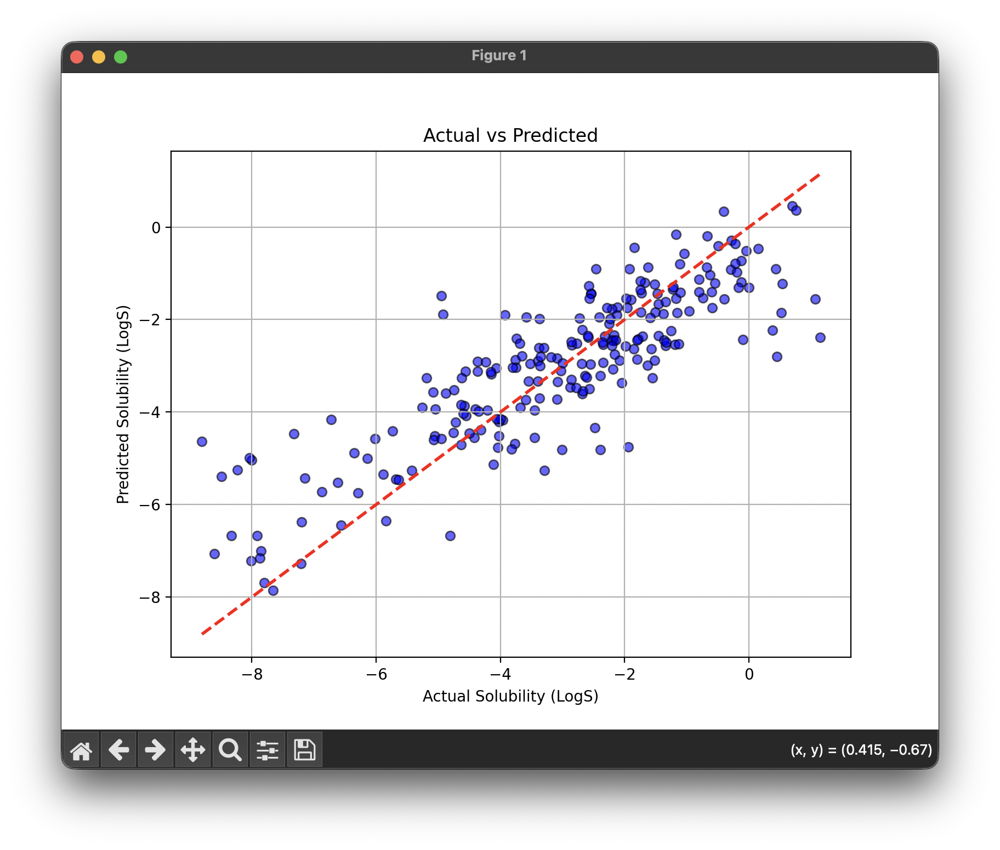

# ChemSolv Predictor

A machine learning project that predicts the water solubility of chemical compounds using molecular fingerprints and *Random Forest* regression.

## What This Does

This project takes chemical structures represented as SMILES strings and predicts their water solubility on a logarithmic scale. The model uses Morgan fingerprints to convert molecular structures into numerical features, then trains a random forest regressor on the Delaney solubility dataset.

When you run the code, it downloads the dataset, trains the model, displays a visualization comparing predicted versus actual solubility values, and then makes predictions for a set of custom molecules, including water, ethanol, aspirin, and others.

## How It Works

The code converts SMILES strings into molecular fingerprints using RDKit. These fingerprints capture structural features of molecules in a numerical format that machine learning models can understand. The random forest algorithm then learns patterns from these fingerprints to predict solubility values.

The model achieves an R2 score around 0.70, which means it explains about 70 percent of the variance in solubility data. This is reasonable for a relatively simple model working with molecular fingerprints.

## Installation

Make sure you have Python installed, then install the required packages:

```
pip install -r requirements.txtThe main 
```
dependencies are pandas for data handling, numpy for numerical operations, scikit-learn for the machine learning model, RDKit for molecular processing, and matplotlib for visualization.

## Usage

Simply run the main script:
```
python main.pyThe 
```
script will automatically download the training dataset, train the model, display a scatter plot showing model performance, and then print predictions for the custom molecules defined in the code.



## Customizing Predictions

You can modify the custom_molecules dictionary in main.py to test different compounds. Just add entries with the molecule name and its SMILES string. The code will automatically generate predictions for any valid SMILES strings you provide.

## Model Parameters

Several parameters in the code affect model performance and can be adjusted:

- Fingerprint size: The nBits parameter controls the dimensionality of molecular fingerprints. Larger values capture more detail but increase computation time.
- Fingerprint radius: The radius parameter determines how far from each atom the fingerprint extends. Higher values capture more distant structural features.
- Train test split: The test_size parameter controls what fraction of data is used for testing versus training.
- Number of trees: The n_estimators parameter sets how many decision trees are in the random forest. More trees generally improve accuracy but take longer to train.

Feel free to experiment with these values to see how they affect model performance.
